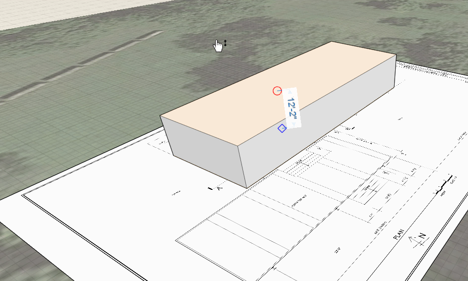

### Skizzieren in 3D

---

> Das Platzieren von Grundkörpern ist eine sehr nützliche Funktion, die wirkliche Stärke von FormIt liegt jedoch in der Möglichkeit, dreidimensional zu skizzieren. In der letzten Übung, in der die Verwendung des Werkzeugs Drehen gezeigt wurde, haben Sie bereits einen Eindruck zur Funktionsweise des Objektfangs erhalten. Wenn Sie den letzten Abschnitt nicht bearbeitet haben, laden Sie die Datei **farnsworth01.axm** aus dem [Ordner FormIt Primer](https://autodesk.app.box.com/s/thavswirrbflit27rbqzl26ljj7fu1uv/1/9025446442) herunter und öffnen Sie sie.

---

#### Skizzieren in 3D mithilfe von Linien

1. Um die Bildebene als Gruppe zusammenzufassen, sodass die skizzierten Linien nicht "hängen bleiben" können, wählen Sie die Ebene durch Doppelklicken aus, klicken Sie mit der rechten Maustaste und wählen Sie **Gruppe (G)**.

2. Klicken Sie auf das **Bleistiftsymbol**, um den [**Werkzeugkasten zum Skizzieren**](../formit-introduction/tool-bars.md) zu öffnen.

3. Wählen Sie das [**Werkzeug Linie (L)**](../tool-library/line-tool.md).

4. Sie können sofort mit dem Skizzieren gerader Liniensegmente beginnen. Klicken Sie [**hier**](../tool-library/world-axes.md), um mehr zum Skizzieren in 3D mit Weltachsen zu erfahren.

5. Beginnen Sie, indem Sie ein Rechteck auf der Grundplatte erstellen.

* Klicken Sie auf **Einstellungen > Option Rasterfang deaktivieren (S G)**.
* Klicken Sie mit dem **Werkzeug Linie ** auf **eine Ecke** der importierten Skizze. Definieren Sie durch **Ziehen** eine Kante der oberen Terrasse.
* Geben Sie mithilfe der **Tabulatortaste** die exakten Maße an. Legen Sie für die lange Seite **77'-4 1/8"** und für die kurze Seite **28'-8**" fest.
* Drücken Sie die **Esc-Taste**. Damit gelangen Sie zurück in den Auswahlmodus. Jetzt können Sie die obere Fläche auswählen und nach oben ziehen, um einen Volumenkörper zu erhalten (um **12'-2"**). 

**Anmerkung:** * Mit der roten und grünen Achse bleibt die Ausrichtung stets rechtwinklig. Wenn Sie in einem anderen Winkel relativ zum Raster zeichnen, wird eine violette Hilfslinie angezeigt, die Ihnen eine rechtwinklige Ausrichtung relativ zu Ihrer aktuellen Linie ermöglicht.*

#### Optional: Skizzieren in 3D mithilfe der übrigen Werkzeuge

---

> Die folgende Übung ist nicht unbedingt erforderlich, um das Haus fertigzustellen. Sie haben hier jedoch die Möglichkeit, mit einigen der übrigen Werkzeuge zum Skizzieren in 3D zu experimentieren.

---

1. Wählen Sie in der [**Aktionsleiste**](../formit-introduction/tool-bars.md) das Werkzeug Skizzieren (Bleistiftsymbol) und dann das [**Werkzeug Bogen**](../tool-library/arc-tool.md).

* Klicken Sie ähnlich wie beim Werkzeug Linie auf den ersten und zweiten Punkt.
* Indem Sie in einem dritten Schritt ziehen, legen Sie den Radius des Kreises fest, der den Bogen definiert.
* **Anmerkung:** * Wie bei allen Skizzierwerkzeugen können Sie auch hier mithilfe der roten Fangpunkte andere Objekte in der Szene als Fangreferenzen nutzen.*

2. Wählen Sie das Werkzeug [**Spline**](../tool-library/spline-tool.md).

* Definieren Sie durch Klicken auf die gewünschten Stellen beliebig viele Punkte, um einen Spline zu zeichnen.

3. Wählen Sie das [**Werkzeug Kreis**](../tool-library/circle-tool.md).

* Setzen Sie den Mauszeiger auf die gewünschte Stelle und klicken Sie, um den Mittelpunkt des Kreises zu definieren.
* Bestimmen Sie durch Klicken und Ziehen den Radius des Kreises.

**Wichtiger Hinweis:*** Wenn Sie ein Kurvensegment durch Objektfang an einem beliebigen anderen Punkt, einer Linie oder an einer Fläche, einer Kante oder einem Punkt auf einem Objekt erstellen, werden die Objekte zu einem einzigen Objekt verbunden. Um dies zu vermeiden, verwenden Sie Gruppen wie in einer späteren Übung beschrieben.*

