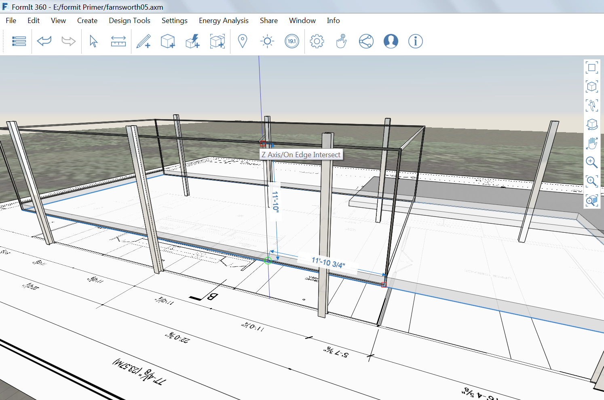

### Hinzufügen von Details

---

> Wenn Sie den letzten Abschnitt nicht bearbeitet haben, laden Sie die Datei **farnsworth04.axm** aus dem [Ordner FormIt Primer](https://autodesk.app.box.com/s/thavswirrbflit27rbqzl26ljj7fu1uv/1/9025446442) herunter und öffnen Sie sie.

---

#### Türrahmen

Sie erstellen einen 2" breiten Metallrahmen und Pfosten um das Fensterglas.

1. Zunächst müssen Sie den Layer mit dem Dach **ausblenden**.

2. Zeichnen Sie mithilfe des [**Werkzeugs Rechteck (R)**](../tool-library/rectangle-tool.md) eine Oberfläche über die westliche Glasfläche.

3. Versetzen Sie ein weiteres Rechteck mithilfe des [**Werkzeugs Fläche versetzen (OF)**](../tool-library/extrude-cut-and-offset-faces.md) und der **Tabulatortaste** um **2"** nach innen.

4. **Wählen** Sie den Rahmen aus und **extrudieren** Sie ihn um 2" zur Innenseite. 

5. Gruppieren Sie die Baugruppe und geben Sie ihr den Namen **EW Frame**.

6. Importieren Sie das Material **Metall > Eloxiert – grau** und weisen Sie es der Stütze zu.

7. [**Kopieren** Sie die Baugruppe oder erstellen Sie eine **Reihe**](../tool-library/tilt-array-copy-and-paste.md), um sie an der Ostseite des Gebäudes zu reproduzieren.

8. Führen Sie die Schritte 1-6 auch für die Nord- und Südseite durch.

#### Pfosten erstellen

1. Erstellen Sie auf dieselbe Weise wie in der letzten Übung einen Pfosten von 2" Dicke und Tiefe **11'-10 ¾"** von der nordwestlichen Ecke entfernt. 

2. Wählen Sie als Länge des Pfostens die gesamte Höhe des Glaswände (11'10").

3. Gruppieren Sie die Baugruppe und geben Sie ihr den Namen **Mullion**.

4. Importieren Sie das Material **Metall > Eloxiert – grau** und weisen Sie es der Stütze zu.

5. Erstellen Sie eine [**Reihe**](../tool-library/tilt-array-copy-and-paste.md) mit drei weiteren Elementen im Abstand von **11'**.

6. Wählen Sie mit der **Maus + Tabulatortaste** alle Pfostenexemplare aus und **kopieren** Sie sie an die Südseite der Wand.

#### Tür erstellen

Erstellen Sie auf dieselbe Weise wie in den beiden vorigen Übungen eine Doppeltür mit den Maßen 3'-6" in der Mitte der Ostwand. 

---

#### Verwandte Themen:

[**Abdeckung, Sweep, Erhebung**](../tool-library/cover-sweep-loft.md)

