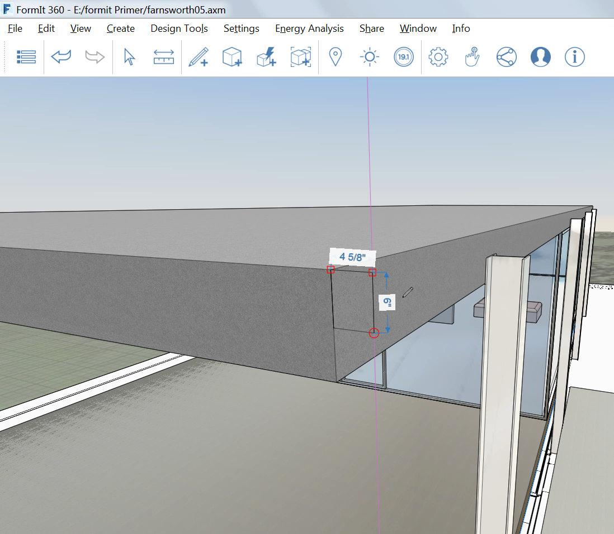
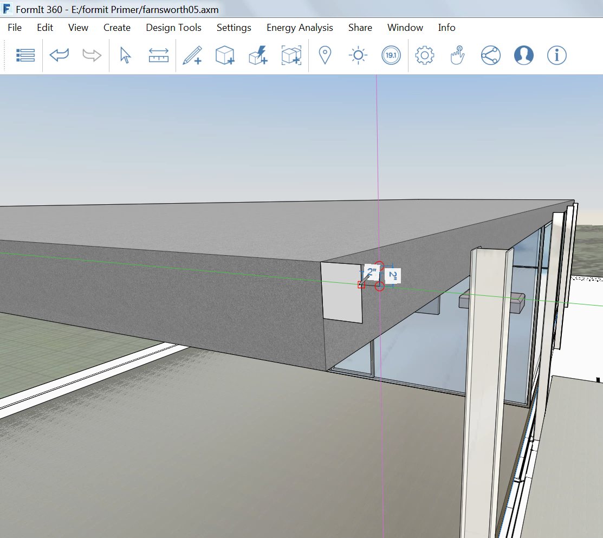
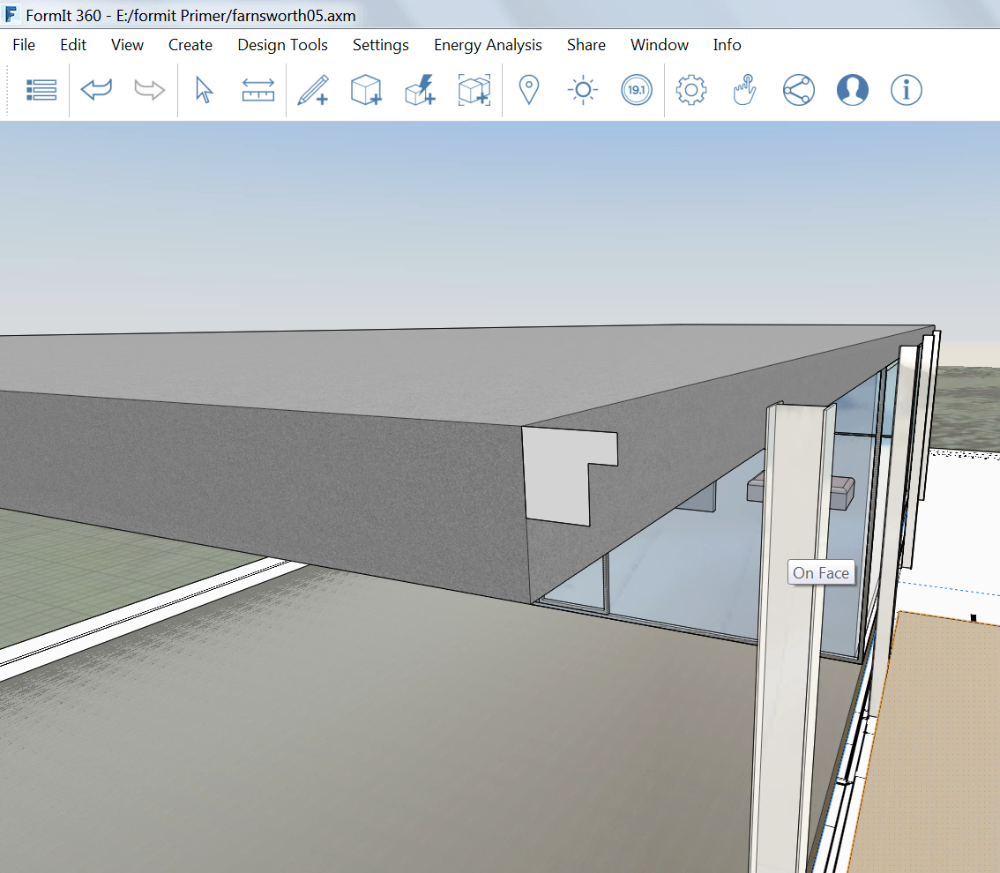

### Erweiterte Modellierung

---

> Wenn Sie den letzten Abschnitt nicht bearbeitet haben, laden Sie die Datei **farnsworth05.axm** aus dem [Ordner FormIt Primer](https://autodesk.app.box.com/s/thavswirrbflit27rbqzl26ljj7fu1uv/1/9025446442) herunter und öffnen Sie sie.

---

#### Erweiterte Modellierung – Abrunden

Erstellen Sie mithilfe des Werkzeugs Abrunden eine abgerundete Kante für die Liege.

1. Erstellen Sie ein Rechteck mit den Maßen **4' x 210 x 1'-6" (Höhe)** im Aufenthaltsraum des Hauses.

2. Wählen Sie das [**Werkzeug Abrunden (FI)**](../tool-library/cover-sweep-loft.md) aus den **Werkzeugen für die erweiterte Modellierung** in der [**Aktionsleiste**](../formit-introduction/tool-bars.md). 

3. Wählen Sie die obere Fläche aus und wählen Sie **2"** als Rundungsabstand. Klicken Sie auf das **Häkchen** in der oberen linken Ecke, um den Vorgang abzuschließen.   

---

#### Erweiterte Modellierung – Sweep

Erstellen Sie mithilfe des Werkzeugs Sweep ein Sims am Dach.

1. Erstellen Sie ein Rechteck mit den Maßen **6" (Höhe) mal 4 5/8"** an der südwestlichen Ecke des Dachs. 

2. Erstellen Sie durch 3D-Skizzieren eine Fuge mit den Maßen **2" x 2"**. 

3. **Löschen** Sie die Linie zwischen den beiden Rechtecken, um eine einzige Form zu erhalten. 

4. Wählen Sie das [**Werkzeug Sweep (SW)**](../tool-library/cover-sweep-loft.md) aus dem [**Menü Erweiterte Modellierung**](../formit-introduction/tool-bars.md).   

5. Wählen Sie die Kontur für den Sweep-Vorgang aus. 

6. Wählen Sie dann die obere Fläche des Dachs als Pfad aus. Klicken Sie auf das **Häkchen**, um den Sweep-Vorgang abzuschließen.

7. Importieren Sie das Material **Beton > weiß** und weisen Sie es dem Sims zu, sodass dieses zum Dach passt.

