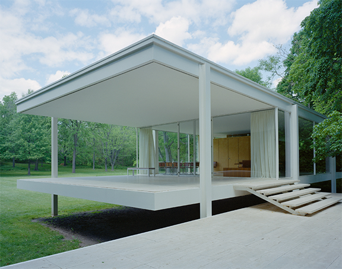

> Version 0.1, ©2016 Autodesk, Inc. 13. Juli 2016

### Erstellen des Farnsworth House

In dieser Einführung werden die Werkzeuge von FormIt vorgestellt. Dabei bauen Sie ein komplettes historisches Haus im modernistischen Stil in weniger als zwei Stunden. Detaillierte Erläuterungen zu den hier beschriebenen Werkzeugkästen, Werkzeugen und Vorgängen finden Sie in der [**Werkzeugbibliothek**](../tool-library/tool-library.md).

#### Voraussetzungen für diese Übungslektion:

* Laden Sie FormIt 360 wie im Abschnitt [**Voraussetzungen und Installation**](../formit-introduction/prerequisites-and-installation.md) in der der Einführung zu FormIt beschrieben herunter und installieren Sie die Anwendung.
* Die Datensätze können von [**Autodesk Primer Data Sets**](https://autodesk.app.box.com/s/thavswirrbflit27rbqzl26ljj7fu1uv) heruntergeladen werden.

**Anmerkung:** *Wenn Sie FormIt 360 für Windows nicht ausführen können, kann der größte Teil der Übungslektion in der kostenlosen Web-Version bearbeitet werden:* [**Windows-Anwendung**](http://formit360.autodesk.com/app)

