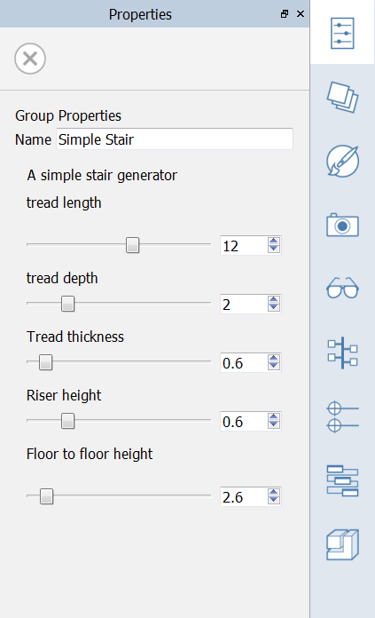

### Durch Computational Design erstellte Gruppen aus Dynamo

---

> In diesem Abschnitt nutzen Sie die Computational Design-Funktionen von [Dynamo](http://dynamobim.org/) zum Platzieren und Ändern flexibler Gruppen.

> Wenn Sie den letzten Abschnitt nicht bearbeitet haben, laden Sie die Datei **farnsworth06.axm** aus dem [Ordner FormIt Primer](https://autodesk.app.box.com/s/thavswirrbflit27rbqzl26ljj7fu1uv/1/9025446442) herunter und öffnen Sie sie.

---

#### Platzieren und Ändern von Dynamo-Gruppen

1. Öffnen Sie die [**Dynamo-Palette**](../formit-introduction/tool-bars.md) in der Palettenleiste. 

2. Klicken Sie auf das **+**-Symbol.

3. Fügen Sie die folgende URL in das Feld ein: [https://www.dynamoreach.com/share/5780fb888794379c4b65b941](https://www.dynamoreach.com/share/5780fb888794379c4b65b941)

4. Dadurch wird eine bereits erstellte Dynamo-Gruppe namens Simple Stair geladen. Klicken Sie auf das **Symbol in der Palette**. Die Treppe wird in die Szene geladen. 

5. Wechseln Sie in die**Draufsicht** und **platzieren Sie die Treppe** ungefähr an der Stelle zentriert, an der die Treppe zur tieferen Terrasse im Plan angezeigt wird.

6. Doppelklicken Sie auf die Gruppe, um sie zu bearbeiten, und wechseln Sie zur [**Eigenschaftenpalette**](../formit-introduction/tool-bars.md).

7. Bearbeiten Sie die Einstellungen:   

8. Nachdem Sie die Treppe platziert haben, **kopieren** Sie sie auf die obere Terrasse. Klicken Sie mit der rechten Maustaste auf die kopierte Gruppe und wählen Sie **Als eindeutig definieren (M U)**.

9. Doppelklicken Sie auf die kopierte Gruppe, um sie zu bearbeiten, und **ändern Sie die Einstellung der Geschosshöhe** in **1.5**.

