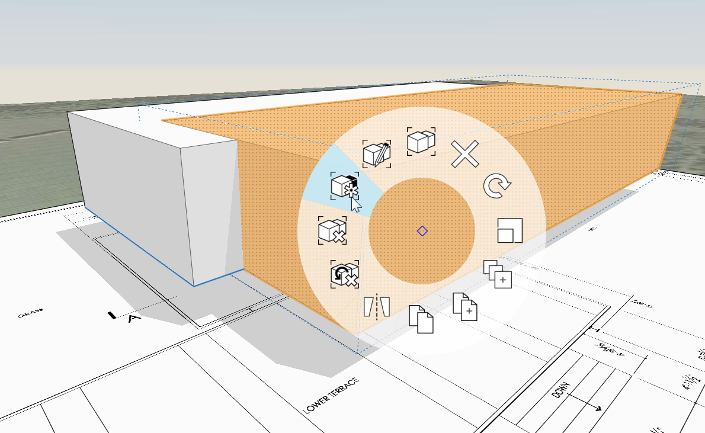

### Layer

---

> Layer in FormIt ermöglichen ähnlich wie in AutoCAD und Photoshop die Verwaltung der Sichtbarkeit von Objekten in der Szene. Hier erstellen Sie einen Layer, der das Speichern und Ausblenden des Gebäudekörpers für die spätere Analyse ermöglicht.

---

1. Klicken Sie auf die [**Layer-Palette**](../formit-introduction/tool-bars.md) und dann zweimal auf das **+**-Zeichen, um drei Layer zu erhalten.

2. Doppelklicken Sie auf die Layer, um sie umzubenennen: **Massing, Floor 1, Plan Image**.   

3. Wählen Sie die **Gruppe Massing** aus und wählen Sie den **Layer Massing** aus dem Menü Auswahl auf in der Layer-Palette.

4. Erstellen Sie eine Kopie der Gruppe, indem Sie die **Strg + C** und dann **Strg + V** drücken.

5. Klicken Sie mit der rechten Maustaste auf die kopierte Gruppe und wählen Sie **Als eindeutig definieren (MU)**. Die Gruppe ist jetzt eine eigenständige Gruppe und wird nicht zusammen mit der anderen aktualisiert. 

6. Wählen Sie die **neu erstellte Gruppe** aus und wählen Sie **Floor 1** aus dem Menü. Dies ist die Grundlage für das Erdgeschoss.

7. Verschieben Sie sie an genau dieselbe Position, an der sich die Originalgruppe befindet, indem Sie die linke untere Ecke auswählen.

8. Deaktivieren Sie das Kontrollkästchen für den Layer **Massing**, um ihn auszublenden.

9. Bearbeiten Sie die **Gruppe Floor 1** und wählen Sie ihre **obere Fläche** aus. Verschieben Sie sie um **11'-2"** nach unten. Die resultierende Geschossdecke muss 1' dick sein.

10. Wählen Sie die Gruppe für das Planbild aus, erstellen Sie einen neuen Layer namens **Plan Image** und weisen Sie diesem die Gruppe zu.

