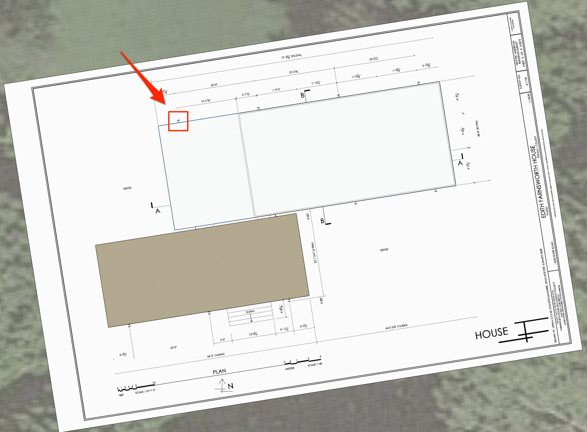
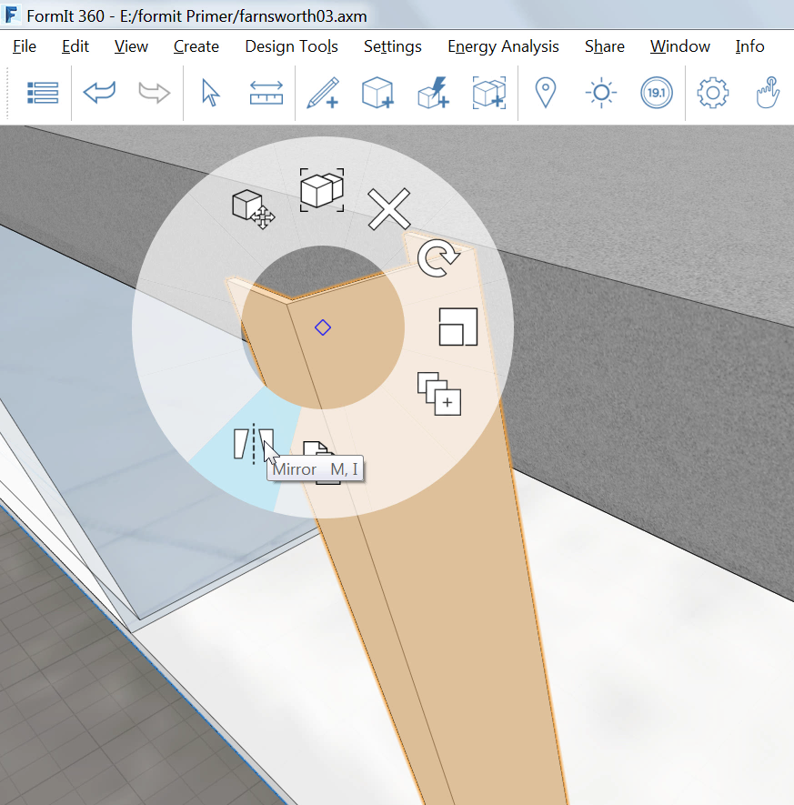
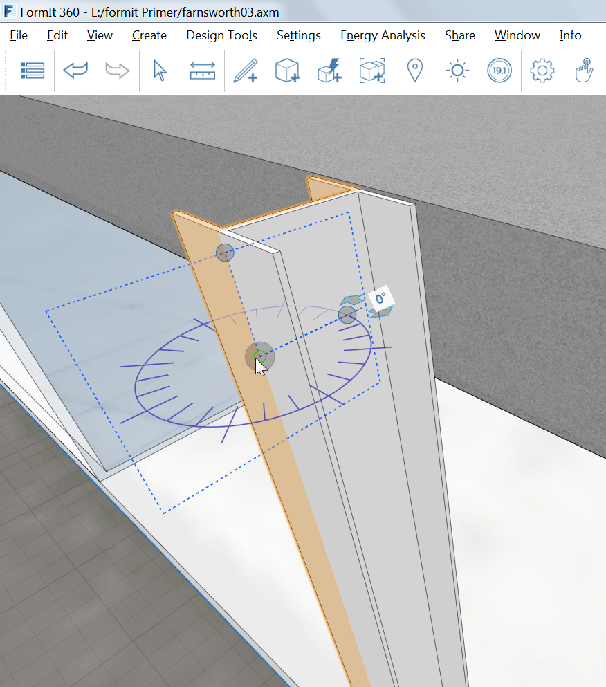

### Erstellen von Stützen mit Reihen

---

> Wenn Sie den letzten Abschnitt nicht bearbeitet haben, laden Sie die Datei **farnsworth03.axm** aus dem [Ordner FormIt Primer](https://autodesk.app.box.com/s/thavswirrbflit27rbqzl26ljj7fu1uv/1/9025446442) herunter und öffnen Sie sie.

---

1. Vergrößern Sie in der linken oberen Ecke der Zeichnung die Stelle, an der die Stütze in der Draufsicht angezeigt wird.

2. Erstellen Sie mithilfe des [**Werkzeugs Linie (L)**](../formit-introduction/tool-bars.md) die folgende Skizze. 

3. Wenn die Form fertig ist, **extrudieren** Sie sie und verbinden Sie sie mithilfe des Objektfangs mit dem Dach.

4. Wählen Sie das Objekt durch Doppelklicken aus. Klicken Sie mit der rechten Maustaste und wählen Sie das [**Werkzeug Spiegeln (MI)**](../tool-library/mirror.md).

5. Verschieben Sie das Spiegeln-Widget und erstellen Sie durch Objektfang an der vertikalen Kante der Stütze eine I-Form. 

6. Bereinigen Sie die Kanten, um eine einzelne durchgehende Form zu erhalten. 

7. Gruppieren Sie die Stütze, bearbeiten Sie die Gruppe, wobei Sie Ihr den Namen **Stütze hoch** geben, und wählen Sie im Menü Kategorie den Eintrag **Allgemeine** **Modelle**.

8. Importieren Sie das Material **Metall > Eloxiert – weiß** und weisen Sie es der Stütze zu.

### Stützen in Reihe anordnen

---

1. Wählen Sie die Stützengruppe aus.

2. Klicken Sie mit der rechten Maustaste und wählen Sie [**Reihe (AR)**](../tool-library/tilt-array-copy-and-paste.md).

3. Nehmen Sie die folgenden Einstellungen vor:

* Länge zwischen Kopien
* Linear
* Anzahl der Kopien: 3

4. Klicken Sie auf **OK** und ziehen Sie den Cursor mit Einschränkung auf die rote Achse nach rechts.

5. Drücken Sie die Tabulatortaste und geben Sie **22'** ein. Damit erhalten Sie vier Stützen im Abstand von 22' .

6. **Setzen Sie den Cursor auf die erste Stütze** und drücken Sie die **Tabulatortaste**: Alle vier Stützen werden ausgewählt.

7. Erstellen Sie eine weitere Reihe, wobei Sie diesmal jedoch nur eine Kopie erstellen, die alle vier Stützen umfasst, und platzieren Sie die Kopien mithilfe des Objektfangs an der Südseite des Gebäudes. 

### Eindeutige Gruppen erstellen

---

1. Wiederholen Sie Schritt 7 oben für die beiden Stützen an der Südwestseite des Gebäudes.

2. Kopieren Sie sie an die Südseite der tieferen Terrasse.

3. **Klicken Sie mit der rechten Maustaste** auf beide kopierte Gruppen und wählen Sie **Als eindeutig definieren (M U )**. Die beiden kopierten Stützen gehören jetzt zu einer neuen Gruppe.

4. Bearbeiten Sie eine der neuen Gruppen, wobei Sie ihr den Namen **Stütze kurz** geben.

5. Bearbeiten Sie die Gruppe, wobei Sie die neuen Stützen auf die Höhe der tieferen Terrasse verkürzen. Verwenden Sie den Wert **3’-2”**.

6. Verwenden Sie die Draufsicht zur Orientierung und erstellen Sie zwei weitere Kopien von Stütze kurz, mit dem folgenden Ergebnis: 

