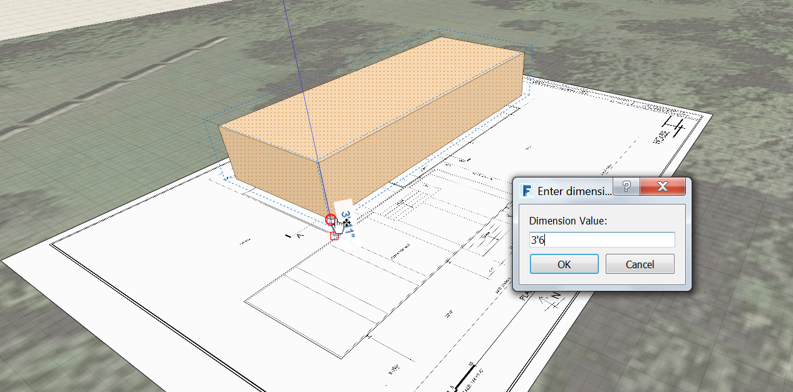
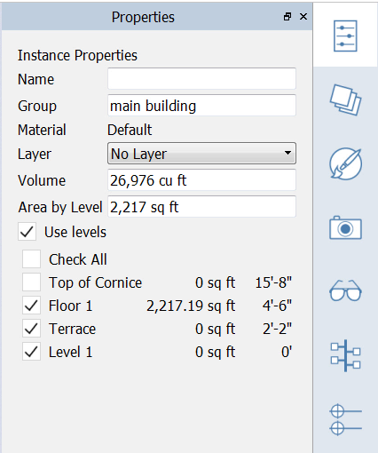

### Gruppen

---

> Jedes Mal, wenn Sie in FormIt den Objektfang mit einer Linie oder einem Objekt als Referenz verwenden, wird eine Verbindung erstellt. Durch Gruppieren von Objekten können Sie dies vermeiden. Für Kopien von Gruppen bleibt darüber hinaus die Verbindung zum Original erhalten. Wird eine solche Kopie der Gruppe bearbeitet, werden die Änderungen für sämtliche Exemplare übernommen. Diese Funktionsweise ist ähnlich wie bei Komponenten in SketchUp und Familienexemplaren in Revit.

> Wenn Sie den letzten Abschnitt nicht bearbeitet haben, laden Sie die Datei **farnsworth02.axm** aus dem [Ordner FormIt Primer](https://autodesk.app.box.com/s/thavswirrbflit27rbqzl26ljj7fu1uv/1/9025446442) herunter und öffnen Sie sie.

---

#### Gruppe erstellen und bearbeiten

1. Wählen Sie den **ersten rechteckigen Körper** aus, den Sie erstellt haben.

2. **Klicken Sie mit der rechten Maustaste** und erstellen Sie eine **Gruppe (G)**. 

3. Wählen Sie die Gruppe durch einfaches Klicken aus. **Verschieben** Sie die gesamte Gruppe um **4' 6"** nach oben. Drücken Sie die **Umschalttaste** und halten Sie sie gedrückt, wenn die blaue Hilfslinie angezeigt wird, um die Bewegung auf diese Achse zu beschränken. 

4. Da Sie den Überblick über zahlreiche Gruppen behalten müssen, ist es wichtig, diese zu benennen. Um die Gruppe zu benennen, **doppelklicken** Sie, um in den Bearbeitungsmodus zu wechseln, und öffnen Sie dann die [**Eigenschaftenpalette**](../tool-library/tool-bars-extended.md), um die Gruppe zu benennen. Geben Sie ihr den Namen **"Hauptgebäude"**.   

5. Beenden Sie den Bearbeitungsmodus, indem Sie auf das **Häkchen** in der oberen linken Ecke klicken. 

**Anmerkung:** *Für jede Gruppe ist ein eigener, vom übergeordneten Projekt unabhängiger "Stapel" zum Rückgängigmachen/Wiederholen vorhanden*.

#### Ebenen auf eine Gruppe anwenden

---

1. Wählen Sie das **Hauptgebäude durch einfaches Klicken** aus und öffnen Sie in der Palettenleiste die [**Eigenschaftenpalette**](../formit-introduction/tool-bars.md).

2. Aktivieren Sie das Kontrollkästchen **Ebenen verwenden**. Dadurch werden die Körper durch die von Ihnen gewählten Ebenen „geschnitten“. Klicken Sie auf **Alle markieren**.

3. Unter **Bereich nach Ebene** werden die Gesamtfläche der momentan ausgewählten Objekte und die Fläche jeder einzelnen Ebene angezeigt.

4. Wenn keine blauen Ebenenlinien am Objekt angezeigt werden, wählen Sie **Menü Einstellungen > Bildstil > Ebenen anzeigen (DL)**.   

