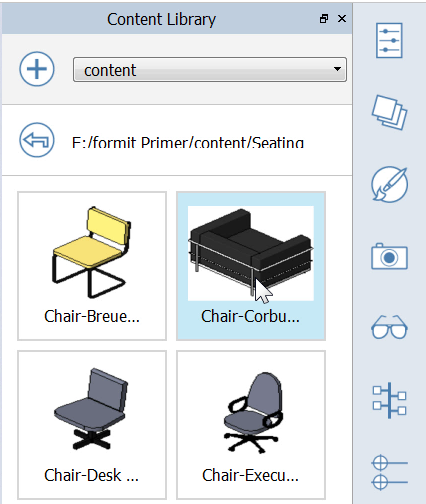

### Import/Export und Inhaltsbibliothek

---

> In diesem Abschnitt importieren und exportieren Sie mithilfe verschiedener Werkzeuge Daten in und aus FormIt 360.

> Wenn Sie den letzten Abschnitt nicht bearbeitet haben, laden Sie die Datei **farnsworth06.axm** aus dem [Ordner FormIt Primer](https://autodesk.app.box.com/s/thavswirrbflit27rbqzl26ljj7fu1uv/1/9025446442) herunter und öffnen Sie sie.

---

#### Gebäudekern und Möbel importieren

1. Wählen Sie Datei > Importieren > 3D-Modell importieren (Strg + I) und importieren Sie **core.axm** aus FormIt Primer/content/components.

2. **Blenden Sie den Layer Floor 1 aus**, um den Plan darunter anzuzeigen.

3. **Verschieben Sie das Kernobjekt** ungefähr an die vorgesehene Stelle in der Planabbildung.

4. Wählen Sie Datei > Importieren > 3D-Modell importieren (Strg + I), importieren Sie **mies_ottoman.SKP** aus FormIt Primer/content/SKP und **platzieren** Sie die Datei im Wohnbereich.

5. Wählen Sie die **Gruppe ottoman** aus, klicken Sie mit der rechten Maustaste und wählen Sie **Gruppierung für alle aufheben (U)**. Dadurch wird die Gruppierung sämtlicher verschachtelter Gruppen aufgehoben. 

6. Wählen Sie die nicht mehr gruppierte Sofageometrie aus. Um dies zu erleichtern, verwenden Sie das Werkzeug **Auswahlfilter** und wählen Sie nur **Volumenkörper**. 

7. Gruppieren Sie diese Geometrie erneut. Bearbeiten Sie die Gruppe und geben Sie ihr den Namen **Mies Ottoman**. Wählen Sie in der Liste Kategorie den Eintrag **Möbel**.  

#### Inhaltsbibliothek einrichten und verwenden

---

1. Öffnen Sie die [**Palette Inhaltsbibliothek**](../formit-introduction/tool-bars.md). 

2. Klicken Sie auf das **+**-Symbol, um einen Pfad zu Ihrer lokalen Inhaltsbibliothek zu erstellen. Wählen Sie den Ordner **FormIt Primer\content** und klicken Sie auf OK. 

3. Wählen Sie den **Ordner Content** aus dem Menü.   

4. Wählen Sie den **Unterordner Seating**.   

5. Wählen Sie den **Corbusier-Stuhl** und **platzieren Sie zwei** Exemplare davon. 

