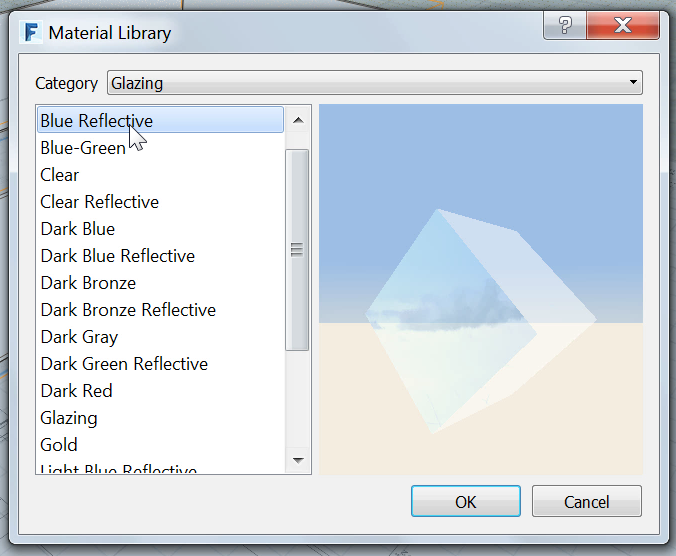

### Materialien

---

> In FormIt ist es wie in der letzten Übung gezeigt möglich, Materialien auf Flächen anzuwenden. In dieser Übung erstellen und bearbeiten Sie eigene Materialien und importieren Materialien aus der Materialbibliothek von Autodesk.

---

#### Glaswände erstellen

1. Erstellen Sie mithilfe des [**Werkzeugs Rechteck (R)**](../tool-library/rectangle-tool.md) eine weitere Oberfläche über dem Geschoss (**28'-8" x 55'-5 ½"**).

2. Ziehen Sie die neue Oberfläche **11'-2"** nach oben.

3. Gruppieren Sie sie und geben Sie ihr den Namen **Glaswände**.

4. Klicken Sie mit der rechten Maustaste auf die obere Fläche und wählen Sie das [**Werkzeug Fläche versetzen (OF)**](../tool-library/extrude-cut-and-offset-faces.md).

5. Drücken Sie die **Tabulatortaste** und geben Sie **4"** ein. 

#### Neues Material importieren

---

1. Bearbeiten Sie die **Gruppe Glaswände **, indem Sie darauf doppelklicken.

2. Wählen Sie die [**Materialpalette**](../formit-introduction/tool-bars.md).

3. Klicken Sie auf die Schaltfläche **Materialien importieren**.   

4. Wählen Sie in der Materialbibliothek den Eintrag **Verglasung** aus dem Menü, und wählen Sie anschließend **Blau – reflektierend**. 

5. **Klicken Sie mit der rechten Maustaste** auf das blaue reflektierende Material, das Sie gerade importiert haben, und wählen Sie **Farbe und Material**. **Doppelklicken Sie auf die Gruppe Glaswände**, um das Material anzuwenden.

**Anmerkung**: *Materialien werden ähnlich wie die Befehle Rückgängig und Wiederholen für jede Gruppe einzeln angewendet.*

1. **Kopieren Sie die Gruppe für Geschoss 1**, um das Dach zu erstellen. Halten Sie dazu die **Strg-Taste** gedrückt, während Sie die Gruppe **ziehen**. 

2. Definieren Sie die kopierte Gruppe als eindeutig, bearbeiten Sie sie und geben Sie ihr den Namen **Dach**. Importieren Sie das Material **Beton > Weiß** und weisen Sie es dem Dach zu.

3. Erstellen Sie die tiefere Terrasse, indem Sie dem Plan folgen, das Werkzeug Rechteck (R) mit den Maßen **55' 3" Länge und 22'-7 3/4" Breite** verwenden und das Rechteck um **1'** extrudieren. Gruppieren Sie dies, und nennen Sie es **Terrasse unten**.

4. Verschieben Sie diese um **2'-2"** vom Boden.

5. Importieren Sie das Material **Stein > Travertin** und weisen Sie es dem Geschoss 1 und der unteren Terrasse zu.

6. Bearbeiten Sie das Travertinmaterial in beiden Gruppen. Klicken Sie auf den **Wert für Farbe** und ändern Sie ihn in **190**, um das Material aufzuhellen. 

