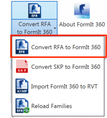
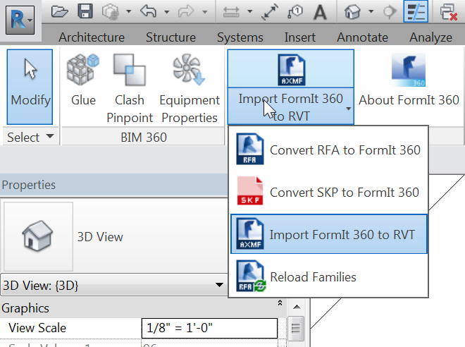

### Konvertieren von Revit-Familien zur Verwendung in FormIt

---

1. Öffnen Sie Revit 2016 oder 2017 und erstellen Sie eine leere Datei aus der Vorlage für Architektur.

2. Wählen Sie auf der Registerkarte Zusatzmodule unter FormIt 360 Converter die Option **RFA in FormIt 360 konvertieren**. 

3. Legen Sie als ersten Pfad **FormIt Primer\content\RFA** und als Pfad für die konvertierten Dateien **FormIt Primer\content** fest und klicken Sie auf OK.

4. Dieser Vorgang nimmt einige Minuten in Anspruch, während Revit die RFA-Dateien unter dem ersten Pfad nacheinander öffnet und in ein Format konvertiert, das FormIt 360 lesen kann.

**Anmerkung:** * Während dieser Übungslektion müssen Sie diesen Vorgang nicht durchführen, da alle Konvertierungen bereits vorgenommen wurden. Der Corbusier-Stuhl und die übrigen Inhalte in der vorherigen Übung wurden von hier übernommen.*

#### Daten aus FormIt in Revit importieren

---

1. Bleiben Sie in Revit und wählen Sie im Zusatzmodul die Option **FormIt 360 in RVT importieren**. 

2. Wählen Sie **farnsworth07.axm** aus dem Ordner FormIt Primer.

3. Dieser Vorgang nimmt einige Minuten in Anspruch, während Revit die einzelnen Objekte in der FormIt-Datei nacheinander in einzelne Familienexemplare für Körper-, Möbel- oder allgemeine Familien konvertiert. 

4. Bei der Analyse der verschiedenen Objekte zeigt sich, dass die meisten davon Körperfamilien angehören. Die Stützen gehören jedoch zu einer allgemeinen Familie. Dies ermöglicht es, die Familie zu bearbeiten und in eine andere Kategorie zu konvertieren, z. B. Tragwerksstützen.

5. Die verschiedenen Möbelobjekte gehören zur Kategorie Möbel. Ein weiteres Werkzeug steht zur Verfügung, mit dessen Hilfe Sie automatisch die in der vorigen Übung konvertierten Objekte austauschen können. Wählen Sie im Zusatzmodul die Option **Familien neu laden**. 

6. Wählen Sie im Dialogfeld **FormIt Primer\content.** Der Konverter erfasst dadurch alle Unterordner in diesem Ordner. Klicken Sie auf OK. Dieser Vorgang nimmt einige Minuten in Anspruch, während jede Familie analysiert, nach einer Überstimmung gesucht und die entsprechende RFA-Datei an ihrer Stelle geladen wird. 

#### Daten aus Revit in FormIt exportieren

---

Es kann erforderlich sein, Daten aus Revit in FormIt zu übernehmen, etwa wenn für einen Teilbereich des Entwurfs in einem bestehenden Revit-Projekt Iterationen benötigt werden. Exportieren Sie eine 3D-Szene aus Revit in das SAT-Dateiformat. Diese Daten können Sie dann zurück in FormIt importieren.

**Anmerkung:** * Informationen zu Familie und Kategorie werden nicht in FormIt 360 zurückübertragen*.

