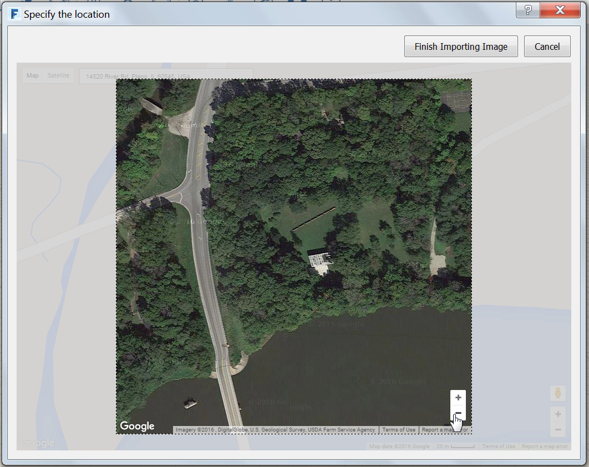
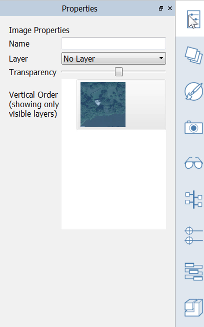

### Festlegen des Standorts

---

> Die Angabe des geografischen Standorts Ihres Projekts ist wichtig für die Genauigkeit von Analysen im weiteren Verlauf des Projekts. Es ist auch möglich, ein skaliertes Satellitenbild als Hintergrundreferenz zu importieren.

---

#### Standort festlegen

1. Wählen Sie als Standort *Farnsworth House*:
* Geben Sie ***Farnsworth Haus*** in das Suchfeld ein. Google Maps ergänzt den realen Standort.
* Sobald Sie die Standortsuche bestätigen, wird der gesuchte Standort in der Mitte der Ansicht angezeigt.

2. Jetzt können Sie auf **Fertig stellen** klicken, um den Standort festzulegen und zur 3D-Szene zurückzukehren.  Sie können außerdem ein skaliertes Satellitenbild importieren (optional):
* Klicken Sie auf **Satellitenbild importieren** und dann auf **Bildimport fertig stellen**. 
* Das Satellitenbild wird maßstabsgetreu und mit dem geografischen Norden nach oben weisend importiert.
* Wechseln Sie zur [**Palette Bildstile**](../tool-library/tool-bars-extended.md) und aktivieren Sie **Nordpfeil**, um eine interaktive Anzeige des geografischen Nordens einzublenden.
* Wechseln Sie wieder zur 3D-Szene und **wählen Sie das Satellitenbild** durch Doppelklicken aus. Öffnen Sie die [**Eigenschaftenpalette**](../tool-library/tool-bars-extended.md) und reduzieren Sie den Wert des Schiebereglers Transparenz auf **1/3**. 

