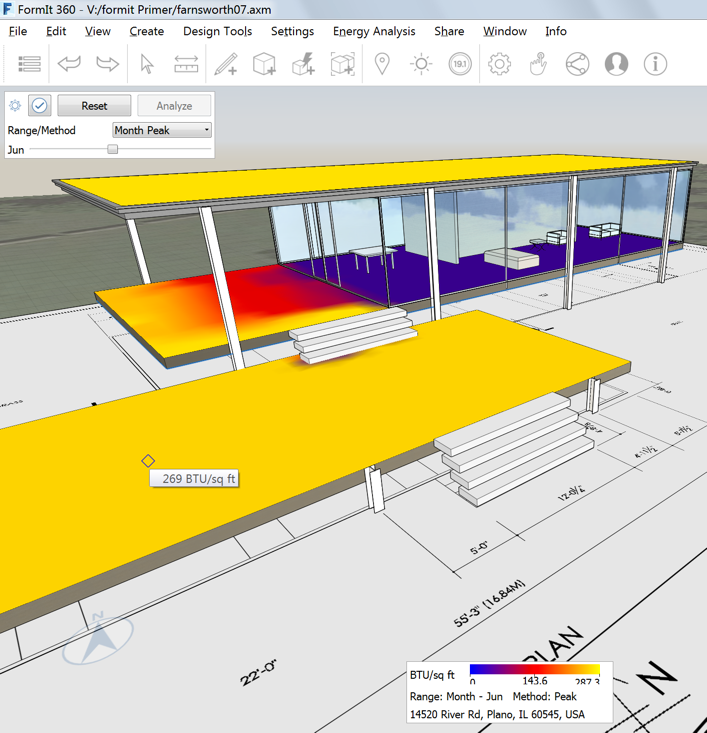

### Sonnenstudie und Energieanalyse

---

> Wenn Sie den letzten Abschnitt nicht bearbeitet haben, wählen Sie Datei > Öffnen und anschließend **farnsworth07.axm** aus dem Ordner FormIt Primer.

---

#### Schatten

Indem Sie den Standort festlegen, können Sie präzise analysieren, wie die vom Sonnenlicht geworfenen Schatten fallen und sich auf Ihren Entwurf auswirken. Aufgrund der Ergebnisse können Sie optimale Entscheidungen treffen.

1. Klicken Sie auf das Sonnensymbol in der [**Aktionsleiste**](../formit-introduction/tool-bars.md) und aktivieren Sie **Schatten anzeigen**.

2. Bewegen Sie die Schieberegler für den Tag und die Uhrzeit, um die Wirkung der Schatten zu beobachten. Bei diesem Haus ist die überdachte Terrasse während der heißesten Tageszeit in den Sommermonaten beschattet. Dies ist kein Zufall, sondern bewusst in dieser Form entworfen.   

#### Sonnenstudie

1. Klicken Sie im selben [**Menü Sonne**](../formit-introduction/tool-bars.md) auf **Sonnenstudie**.

2. Klicken Sie auf die zu analysierenden Oberflächen und dann auf **Analysieren**.

3. Die Einstellung Monatsspitze zeigt die maximale Sonneneinstrahlung in BTU/ ft² für diesen Monat. Indem Sie den Cursor auf eine der analysierten Oberflächen setzen, erhalten Sie deren spezifischen Wert. 

4. Die Einstellung Jahr kumulativ zeigt den Gesamtwert der Energie für das ganze Jahr in kWh/ m². Dieser Wert ist nützlich, um frühzeitig einen Eindruck des Potenzials der Oberflächen Ihres Entwurfs für Photovoltaik zu gewinnen. 

### Energieanalyse mit Insight 360

1. Blenden Sie alle Layer außer der Körpermodellstudie aus.

2. Klicken Sie auf die **Schaltfläche Insight 360 > Insight generieren.** Alle sichtbaren Körper, auf die Ebenen angewendet wurden, werden für die Analyse an Insight 360 gesendet.   

3. Sobald die Analyse abgeschlossen ist, klicken Sie auf Insight anzeigen, um die Ergebnisse anzuzeigen. Optional können Sie die Website direkt auf [http://insight360.autodesk.com](http://insight360.autodesk.com/) besuchen.

