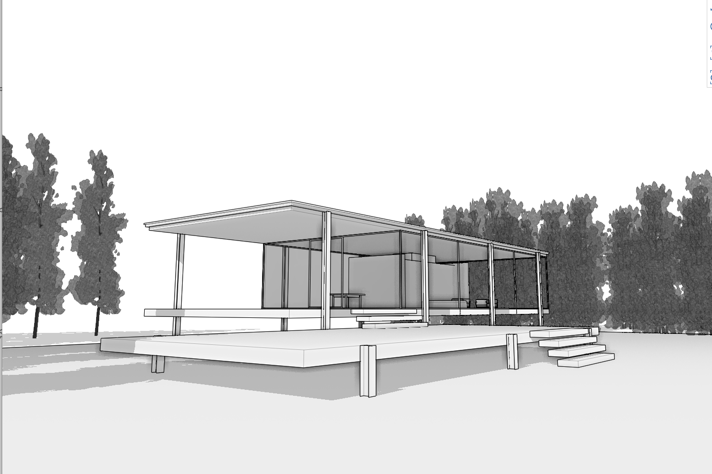

### Darstellungseinstellungen

---

> Wenn Sie den letzten Abschnitt nicht bearbeitet haben, laden Sie die Datei **farnsworth07.axm** aus dem [Ordner FormIt Primer](https://autodesk.app.box.com/s/thavswirrbflit27rbqzl26ljj7fu1uv/1/9025446442) herunter und öffnen Sie sie.

---

#### Szenen

1. Positionieren Sie die Kamera so, dass die Szene der folgenden Abbildung entspricht.

2. Öffnen Sie die [**Szenenpalette**](../formit-introduction/tool-bars.md) und klicken Sie zweimal auf das Pluszeichen (+), um zwei weitere Szenen hinzuzufügen.

3. Benennen Sie die aktuelle Szene in **Southwest Ground** und die andere Szene in **Aerial** um. 

4. Verschieben Sie die Kamera, sodass wie in der Abbildung unten eine Luftaufnahme gezeigt wird.

5. Klicken Sie einmal auf die Szene Aerial und dann auf das Symbol Aktualisieren.  Dadurch wird die aktuelle Kameraposition für die Szene verwendet. 

6. Über die Kontrollkästchen unter Szeneneigenschaften können Sie festlegen, ob Änderungen an den betreffenden Einstellungen sich auf die Szene auswirken sollen.   

7. Klicken Sie auf die Schaltfläche Abspielen , um die Szenen nacheinander abzuspielen.

#### Darstellungseinstellungen

1. Wählen Sie die Szene **Southwest Ground** aus, indem Sie darauf doppelklicken.

2. Wählen Sie die [**Palette Bildstile**](../formit-introduction/tool-bars.md) aus. 

3. Diese Kontrollkästchen bestimmen die Sichtbarkeit der Elemente. Mithilfe der Schieberegler steuern Sie die Linienstärke von Silhouettenkanten und normalen Kanten.

4. Aktivieren Sie die Option **Monotone Oberflächen**. Dadurch werden alle Farben aus der Szene entfernt. Siehe Abbildung unten. 

#### Bild exportieren

Sobald Sie eine oder mehrere Szenen mit den gewünschten Bildstilen erstellt haben, können Sie hochauflösende Bilder der Szene exportieren.

1. **Klicken Sie auf Datei > Exportieren (Strg + E )**.

2. Wählen Sie **Als Bild** aus der Liste.

3. Wählen Sie die Auflösung aus der Liste Voreinstellung oder geben Sie benutzerdefinierte Pixelmaße an. 

