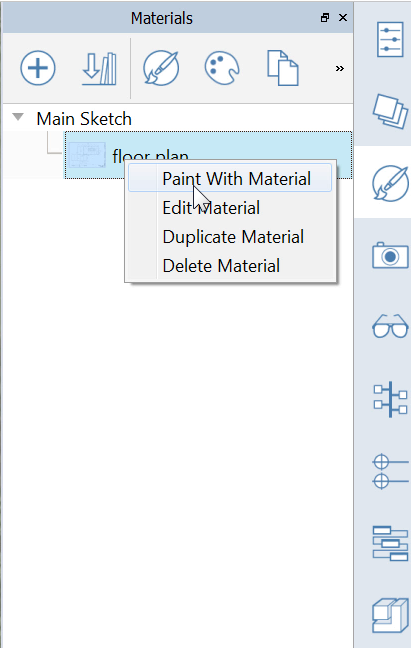
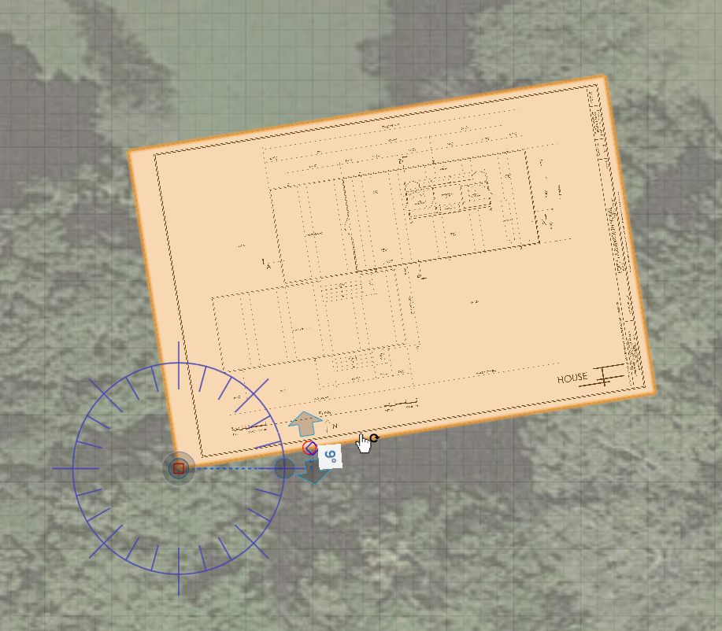

### Arbeiten mit Bildern und der Grundplatte

---

Sie können über das Menü Datei > Importieren PNG-Bilder auf die Grundplatte importieren. Um jedoch den Maßstab und die Position besser steuern zu können, platzieren Sie eine Materialtextur auf eine Ebene. Das Bild **plan.png** ist 3600 Pixel breit und 2400 Pixel hoch. Wenn Sie den Maßstab des Plans ermitteln, stellt sich heraus, dass 1' 25 Pixeln entspricht. Dies ermöglicht es, das Bild in der Szene passend zu skalieren.

1. Wählen Sie das [**Werkzeug Rechteck (R)**](../tool-library/rectangle-tool.md) und zeichnen Sie ein Rechteck mit den Maßen **144'** mal **96'**. Über die **Tabulatortaste** können Sie exakte Bemaßungen eingeben. 

2. Öffnen Sie die [**Materialpalette**](../formit-introduction/tool-bars.md) und klicken Sie auf das **+**-Symbol, um ein neues Material zu erstellen.

3. Klicken Sie auf das **Ordnersymbol** und öffnen Sie **plan.png** aus dem Unterordner FormIt Primer/Drawings.

4. Geben im Feld Horizontal **144'** und im Feld Vertikal **96'** ein und geben Sie dem Material den Namen **Grundriss**. 

5. **Klicken Sie auf OK**, um zur Szene zurückzukehren. In der [**Materialpalette**](../formit-introduction/tool-bars.md) **klicken Sie mit der rechten Maustaste** auf das Material Grundriss, wählen Sie **Farbe und Material** und **klicken Sie auf die Ebene**, die Sie skizziert haben. 

6. **Doppelklicken** Sie auf die **gesamte Ebene**, um sie auszuwählen. **Klicken Sie mit der rechten Maustaste** und wählen Sie [**Drehen (Q)**](../tool-library/placing-and-modifying-objects/rotate.md). Verschieben Sie das Widget zum Drehen in die untere linke Ecke und drehen Sie das Bild um **9 Grad gegen den Uhrzeigersinn**. 

7. **Klicken Sie mit der rechten Maustaste** auf die **Grundplatte** und wählen Sie [**Achsen festlegen (SZ)**](../tool-library/world-axes.md). Verschieben Sie die Achse in die untere linke Ecke der Bildebene. Verschieben Sie die Achse so, dass sie am Winkel der Ebene ausgerichtet ist. Damit ist das Raster der Grundplatte am Bild ausgerichtet und Sie können leichter in 3D skizzieren. 

