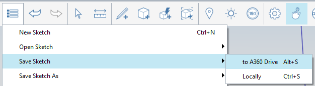

### Einrichten des Projekts

---

> Autodesk 360 Drive ist das zentrale Speichermedium für FormIt. Sie können jedoch auch Dateien auf einem lokalen Laufwerk öffnen, speichern, importieren und exportieren. Die Datensätze für den Farnsworth House Primer werden auf diese Weise geladen, im weiteren Verlauf des Kurses werden Sie sich jedoch mit Ihrem Konto für Autodesk 360 Drive bei FormIt anmelden und Ihre Arbeit dort speichern.

---

#### FormIt 360 herunterladen, installieren und starten

1. Nachdem Sie FormIt 360 wie in den Anweisungen [**hier**](prerequisites-and-installation.md) beschrieben heruntergeladen und installiert haben, öffnen Sie das Programm.

2. Verwenden Sie Ihre eigenen Anmeldedaten für Autodesk 360 zur **Anmeldung bei FormIt** über das [**Menü Benutzer-ID in der Aktionsleiste**](tool-bars.md).   

3. Starten Sie eine neue Skizze über **Schaltfläche Katalog > Neu**. 

* Klicken Sie auf die **Schaltfläche Katalog > Skizze speichern > nach A360 Drive**, um diese im FormIt-Order auf Ihrem A360 Drive zu speichern. 
* Benennen Sie Ihre FormIt-Skizze.
* Jedes Mal, wenn Sie in A360 speichern, laufen zwei Vorgänge ab:
* Eine native FormIt-Datei (AXM) wird auf A360 im FormIt-Ordner gespeichert.
* Einige Minuten später wird eine RVT-Datei des Entwurfs auf A360 in den FormIt-Ordner kopiert. Eine weitere Möglichkeit zur Verwendung von FormIt wird später betrachtet.

4. Sie können zwischen britischen und metrischen **Einheiten** wechseln, indem Sie im [**Menü Einstellungen in der Aktionsleiste**](tool-bars.md) die gewünschte Option wählen. 

---

#### Verwandte Themen:

[Ändern von Arbeitsebenen](../tool-library/work-planes.md)

[Ändern der Weltachsen](../tool-library/world-axes.md)

