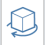

### Navigieren in der Szene

---

> In der Navigationsleiste befinden sich die folgenden wichtigen Werkzeuge zum Navigieren im Arbeitsbereich.

---

**1. Umkreisen** Klicken Sie mit der rechten Maustaste und ziehen Sie oder verwenden Sie das Werkzeug Umkreisen aus der Navigationsleiste und ziehen Sie bei gedrückter linker Maustaste, um das Modell zu umkreisen.

**2. Zoom** Zoomen Sie mit dem Mausrad oder verwenden Sie das Werkzeug Zoom aus der Navigationsleiste und ziehen Sie bei gedrückter linker Maustaste, um im Modell ein- und auszuzoomen.

**3. Verschieben** Ziehen Sie bei gedrückter mittlerer Maustaste oder verwenden Sie das Werkzeug Verschieben (das Handsymbol) aus der Navigationsleiste und ziehen Sie bei gedrückter linker Maustaste, um das Modell zu schwenken.

**4. Walkthrough** Über das Jetpack-Symbol können Sie sich sowohl zwei- als auch dreidimensional in der Szene bewegen. Dies wird in einem späteren Abschnitt genauer beschrieben.

**5. Schwenken**  Mit diesem Werkzeug aus der Navigationsleiste können Sie die Szene von einem bestimmten Punkt aus schwenken.

