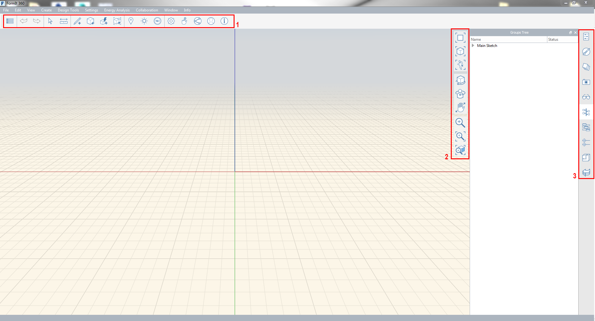

### Symbolleisten

---

---

#### Aktionsleiste

Die Aktionsleiste befindet sich am oberen Rand des Bildschirms. Mithilfe ihrer Werkzeuge können Sie Inhalte erstellen, bearbeiten und freigeben. 

1. Menü Katalog
2. Rückgängig/Wiederholen
3. Auswahl und Messen
4. Werkzeuge zum Erstellen und Bearbeiten
5. Werkzeuge für Standort und Analyse
6. Benutzer-ID
#### Navigationsleiste

1. Modi für Szenenansicht
2. Werkzeuge für 3D-Ansicht
3. Zoomwerkzeuge
#### Palettenleiste

1. Eigenschaften
2. Materialien
3. Layer
4. Szenen
5. Bildstile
6. Gruppenstruktur
7. Dynamo
8. Ebenen
9. Inhaltsbibliothek
10. Rückgängig-Manager

