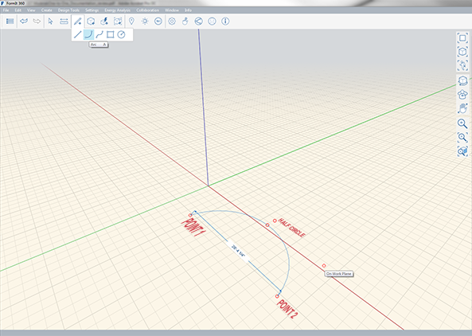

### Werkzeug Bogen

---

> Mithilfe des Werkzeugs Bogen können Sie Halbkreise oder symmetrische Bogen erstellen.

---

Ein Bogen wird durch drei Punkte definiert und kann auf der X-, Y- oder Z-Achse gezeichnet werden. Definieren Sie den ersten Punkt, legen Sie dann die Entfernung vom ersten zum zweiten Punkt fest und definieren Sie schließlich einen dritten Punkt für die Höhe des Bogens. Ein Punkt, der den Halbkreis markiert, wird automatisch angezeigt und kann als Fangpunkt verwendet werden. Jenseits davon wird die Bogenlinie über die ersten beiden Punkte hinaus verlängert.

Während Sie die Position des zweiten Punkts bestimmen, wird die Entfernung zwischen dem ersten und zweiten Punkt angezeigt. Über die **Tabulatortaste** können Sie den Abstand manuell eingeben.

Nachdem Sie den Bogen gezeichnet haben, können Sie die Punkte 1 und 2 mithilfe des [Werkzeugs Linie](line-tool.md) verbinden, um eine Fläche zu erhalten.

