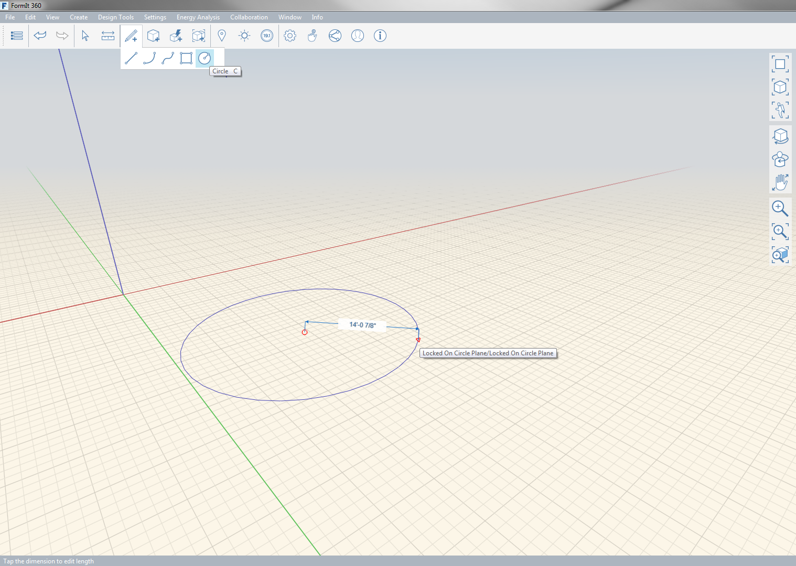

### Werkzeug Kreis

---

> Sie können im Raum oder auf anderen Objekten Kreise zeichnen.

---

Dazu geben Sie zuerst den Mittelpunkt und dann den Radius des Kreises an. Der fertige Kreis ist eine Fläche.

