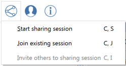
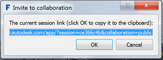

### Zusammenarbeit

---

> Zum Abschluss: Zusammenarbeit in Echtzeit. In FormIt können mehrere Benutzer (mit einer beliebigen Kombination von iOS- oder Web-Clients) gemeinsam ein FormIt-Modell bearbeiten und dabei alle ihre Änderungen in Echtzeit beobachten.

---

Ein Abonnement für FormIt 360 Pro gibt Ihnen Zugang zur Zusammenarbeit in Echtzeit mit den folgenden Funktionen:

* Starten einer Sitzung mit Zusammenarbeit und Einladen von Kollegen oder Kunden, die auch ohne Pro-Version teilnehmen können.
* Teilnahme an der Zusammenarbeit über die Windows-, Web- oder Mobil-App: Sie benötigen lediglich Anmeldedaten für A360.
* Gemeinschaftliche Planung und Experimentieren mit Entwürfen in einer gemeinsam genutzten Sandbox-Umgebung.
* Betrachten des Modells aus der Perspektive von Kollegen über deren Kamera.
* Sie können Kunden erlauben, Ihrer Kamera zu folgen, während Sie den Entwurf vorführen.
* Chat mit Kollegen in der Sitzung.
* [Jetzt Pro-Abonnement kaufen.](http://www.autodesk.com/store/products/formit-360-pro?licenseType=cloudSub&term=1month&support=basic)

#### Sitzung für Zusammenarbeit starten

1. Starten Sie eine Sitzung – dadurch wird eine Sitzung für Zusammenarbeit gestartet. 

2. Sie können jetzt einen Link an einen Kollegen senden. Beim Öffnen des Links wird Ihr Kollege aufgefordert, sich bei A360 anzumelden. Danach können Sie direkt mit der Zusammenarbeit beginnen. 

3. Eine Demonstration dieser Funktion finden Sie hier: [http://formit.autodesk.com/blog/2014/12/04/design-is-a-team-sport-ios-version/](http://formit.autodesk.com/blog/2014/12/04/design-is-a-team-sport-ios-version/).

