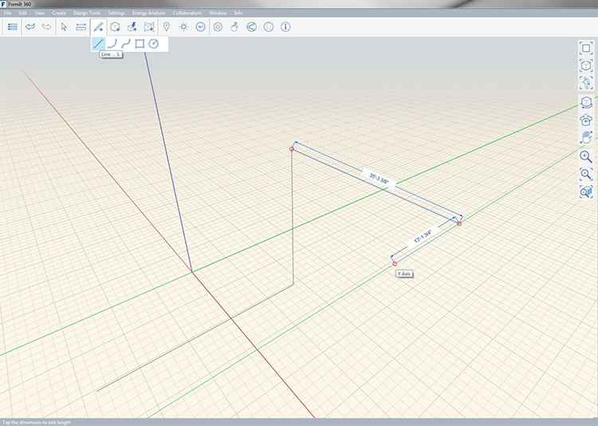

### Werkzeug Linie

---

> Durch Zeichnen von Linien können Sie Flächen teilen und Geometrie konstruieren.

---

Sie können Linien entlang allen Achsen (X, Y, Z) sowie auf bestehender Geometrie zeichnen. Wenn Sie die Bewegung auf eine Achse beschränkt haben, wird beim Zeichnen eine farbige Linie angezeigt, die sich über die gezeichnete Linie hinaus erstreckt. Die Länge der Linie wird beim Zeichnen angezeigt. Um sie manuell anzugeben, drücken Sie die **Tabulatortaste** und geben Sie den Längenwert ein.

* X = Rot
* Y = grün
* Z = Blau

Die Länge der Linie wird beim Zeichnen angezeigt. Um manuell eine Länge einzugeben, drücken Sie die **Tabulatortaste**.

