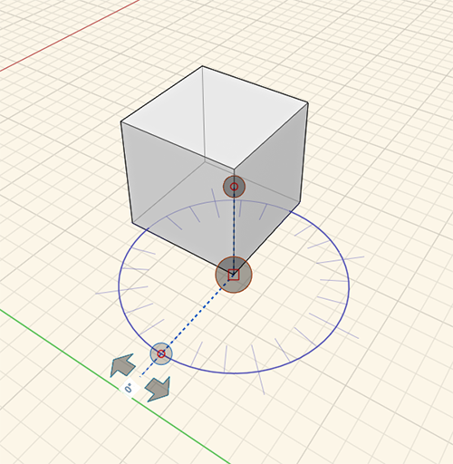
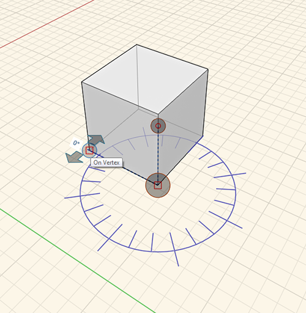
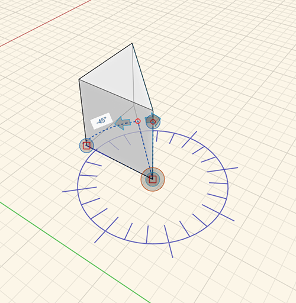

### Werkzeug Winkel messen

---

> Das Werkzeug Winkel messen befindet sich in der [Aktionsleiste](../formit-introduction/tool-bars.md).

---

Das Werkzeug Winkel messen wird zum Messen von Winkeln zwischen Scheitelpunkten, Kanten, Flächen und Volumina verwendet . Mithilfe des Werkzeugs Messen können Sie außerdem Bemaßungen für Geometrie steuern.

* Wählen Sie das Werkzeug Messen aus der Aktionsleiste oder geben Sie die Tastenkombination **M A** ein und wählen Sie den Startpunkt. 
* Klicken Sie auf den Griff und ziehen Sie ihn zum Anfangsscheitelpunkt. 
* Verwenden Sie die Pfeile zum Messen des Winkels zwischen zwei Punkten. 
* Um die Geometrie zu ändern, klicken Sie auf die zu ändernde Fläche/Kante, klicken Sie auf den angezeigten Winkel und geben Sie einen neuen Winkel ein. 
* **Endergebnis:**

