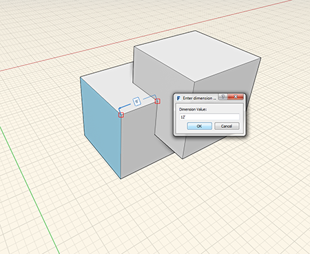

### Werkzeug Messen

---

> Das Werkzeug Messen befindet sich in der [Aktionsleiste](../formit-introduction/tool-bars.md).

---

Das Werkzeug Messen dient zum Messen bereits modellierter Geometrie. Mithilfe des Werkzeugs Messen können Sie außerdem Bemaßungen für Geometrie steuern.

1. Wählen Sie das Werkzeug Messen und messen Sie zwischen zwei Punkten.
2. Wählen Sie die Fläche oder Kante, deren Länge Sie ändern möchten, klicken Sie auf die Zahl und geben Sie einen neuen Längenwert ein.   

