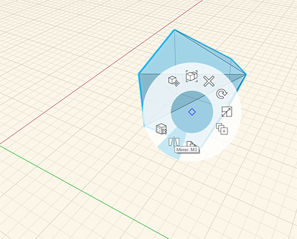

### Spiegeln

---

> Sie können Objekte spiegeln.

---

Dazu doppelklicken Sie zunächst auf das Objekt, um es vollständig auszuwählen. Zum Spiegeln klicken Sie dann mit der rechten Maustaste und wählen Sie Spiegeln oder geben Sie **MI** ein (1). Die daraufhin eingeblendete Ebene zeigt die Achse, an der das Objekt gespiegelt wird (2). Die Ebene kann verschoben oder gedreht werden, um die Spiegelachse anzupassen.

1. 
2. 
3. 

