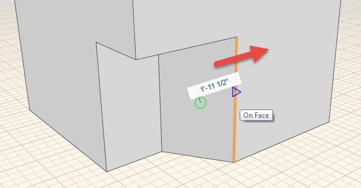
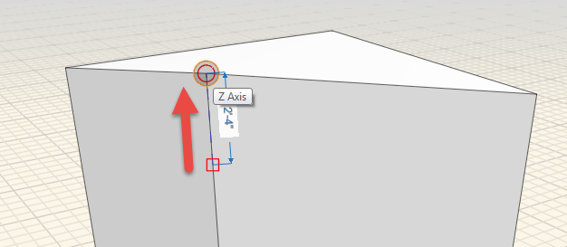

### Ändern von Flächen, Kanten und Punkten

---

> Der interessante Teil der Arbeit beginnt, wenn Sie die platzierten Objekte verschieben. Durch einfaches Klicken wählen Sie eine einzelne Fläche, eine Kante oder, anders als in älteren Versionen von FormIt, eine Ecke oder einen Punkt aus.

---

#### Ändern von Flächen

1. [**Klicken Sie einmal auf eine**](select-edge-face-or-object.md) der Flächen der Objekte.

2. Sie können die Fläche direkt mit der Maus **schieben** oder **ziehen**. Ein separates Werkzeug ist hierfür nicht erforderlich. Mithilfe des **Objektfangs** können Sie diese Fläche an anderen Objekten in der Szene ausrichten.

3. Wie beim Verschieben können Sie auch hier auf die **temporäre Bemaßung** klicken oder über die **Tabulatortaste** die Länge der Verschiebung definieren. 

4. Darüber hinaus können Sie eine Fläche über die **Entf-Taste** oder durch **Rechtsklicken und Wählen der X-Schaltfläche löschen**.
#### Ändern von Kanten

1. Klicken Sie einmal auf eine der Kanten an einem der Würfel.

2. Jetzt können Sie die Kante entlang einer der Achsen ziehen, um die Form neu zu definieren. 

3. Es ist auch möglich, eine Kante zu löschen:

* Drücken Sie die **Entf-Taste**
* **Rechtsklicken > X-Schaltfläche **

#### Ändern von Punkten

1. [Klicken Sie auf](select-edge-face-or-object.md) eine der Ecken an einem der Würfel.

2. Sie können ähnlich wie bei Kanten die Form neu definieren, indem Sie den Punkt entlang einer der Achsen ziehen. 

