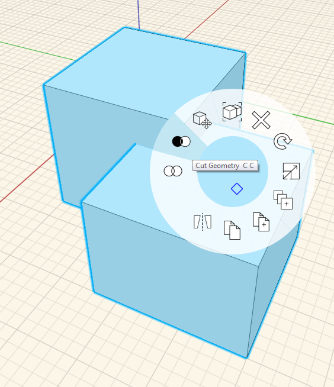
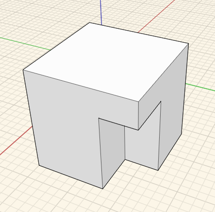

### Boolesche Operationen: Ausschneiden und Verbinden

---

1. Wählen Sie durch Doppelklicken einen der Würfel aus, die Sie erstellt haben.

2. Verschieben Sie einen Würfel so, dass er den anderen überlappt. 

3. Wählen Sie beide Würfel aus. Dazu haben Sie folgende Möglichkeiten:

* Halten Sie die **Strg-Taste** gedrückt, während Sie **doppelklicken**.
* Verwenden Sie ein normales kreuzendes Fenster durch **Klicken mit der linken Maustaste ** und **Ziehen** in der Szene.
* Klicken Sie mit der rechten Maustaste in die Szene und wählen Sie das **Werkzeug Lasso** für eine präzise Auswahl.

4. Zum **Ausschneiden** klicken Sie mit der rechten Maustaste auf das zu schneidende Objekt und wählen Sie im Kontextmenü das [**Werkzeug Ausschneiden**](tool-library/boolean-operations.md).  

5. Zum **Verbinden** klicken Sie mit der rechten Maustaste auf eines der Objekte und wählen Sie im Kontextmenü das [**Werkzeug Verbinden**](tool-library/boolean-operations.md). 

