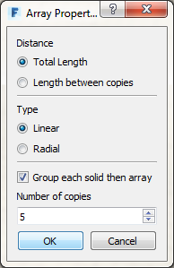

### Objekt kopieren

---

Es gibt drei Möglichkeiten zum Kopieren eines Objekts. Wählen Sie zunächst das Objekt aus, indem Sie darauf **doppelklicken**:

1. Klicken Sie mit der rechten Maustaste auf den Würfel. Wählen Sie im Kontextmenü das Werkzeug [**Kopieren**](tool-library/tilt-array-copy-and-paste.md), klicken Sie anschließend mit der rechten Maustaste auf eine beliebige andere Stelle in der Szene und wählen Sie dann die Schaltfläche **Einfügen**. (Dieser Vorgang ist auch mit **Strg + C** bzw. **V** möglich.)

2. Halten Sie die **Strg-Taste** gedrückt und ziehen Sie das Objekt. Dadurch wird eine Kopie erstellt, die Sie ziehen können.

3. **Klicken Sie mit der rechten Maustaste** auf den Würfel und wählen Sie das [**Werkzeug Reihe**](tool-library/tilt-array-copy-and-paste.md). Geben Sie die gewünschte Anzahl Kopien ein und legen Sie fest, ob mit dem nächsten Ziehvorgang der Abstand zwischen zwei Objekten oder die Gesamtlänge der Reihe definiert werden soll.   

