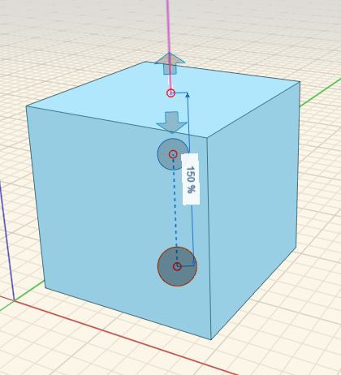

### Skalierung

---

> Sie können die Größe und Ausrichtung von Objekten anpassen.

---

#### Skalierung

Wählen Sie das Objekt aus und klicken Sie mit der rechten Maustaste, um das Kontextmenü zu öffnen. Wählen Sie dann das Skalierungssymbol. Skalieren Sie die Geometrie mithilfe des Mausrads.

