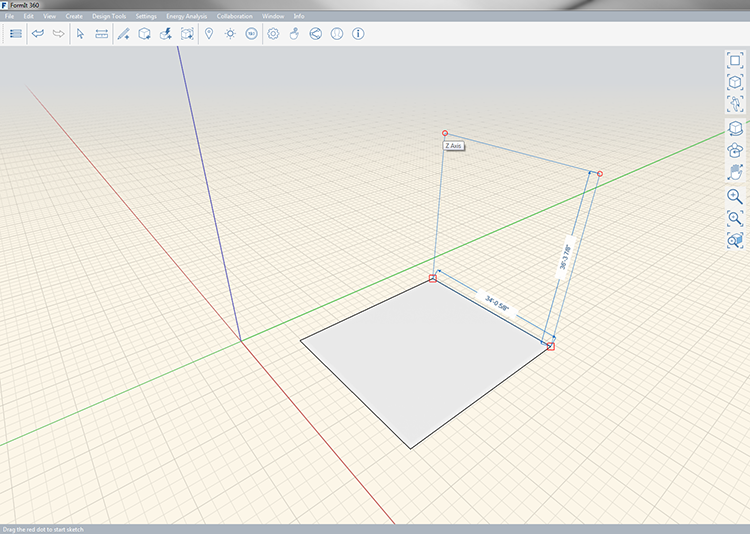

### Werkzeug Rechteck

---

> Zeichnet ein Rechteck, das anschließend in eine Fläche umgewandelt wird. Die resultierende Fläche kann in ein Volumen extrudiert werden.

---

Rechtecke können entlang allen Achsen (X, Y und Z) gezeichnet werden. Wenn Sie die Bewegung auf eine Achse beschränkt haben, wird beim Zeichnen eine farbige Linie angezeigt, die sich über eine Kante des Rechtecks hinaus erstreckt. Sie können die Länge einer Seite des Rechtecks beim Zeichnen anzeigen. Um die Länge manuell anzugeben, drücken Sie die **Tabulatortaste** und geben Sie den Längenwert ein.

* X = Rot
* Y = grün
* Z = Blau

Die Länge der Linie wird beim Zeichnen angezeigt. Um manuell eine Länge einzugeben, drücken Sie die **Tabulatortaste**.

Nachdem Sie das Rechteck gezeichnet haben, wird dieses in eine Fläche konvertiert, aus der Sie durch Extrudieren ein Volumen erstellen können.

