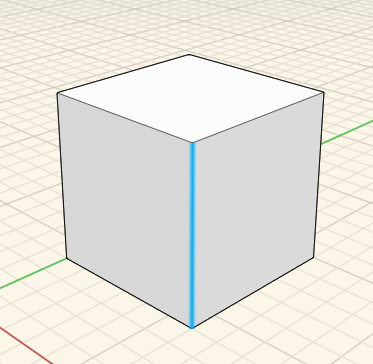
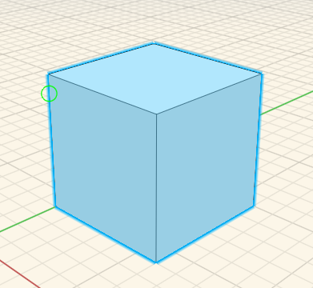
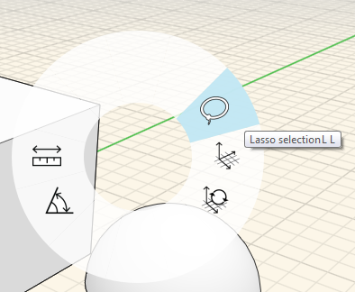

### Kante, Fläche oder Objekt wählen

---

> Die Auswahl eines Objekts oder einer Oberfläche ist der erste Schritt bei der Bearbeitung.

---

Sie können **eine Fläche, eine Kante oder einen Scheitelpunkt auswählen**, indem Sie den Cursor darauf setzen und einmal klicken.

Durch Doppelklicken **wählen Sie das gesamte Objekt aus**.

Zur **Auswahl mehrerer Geometrieobjekte auf einmal** verwenden Sie die Fensterauswahl. Stellen Sie sicher, dass nicht ausgewählt ist. Dann können Sie klicken und die Maus entweder von links nach rechts oder von rechts nach links ziehen.

Verwenden Sie das Lassowerkzeug, wenn Sie mehrere Geometrieobjekte mit **größerer Präzision** auswählen möchten. Es steht im Kontextmenü zur Verfügung, das Sie durch Rechtsklicken im leeren Arbeitsbereich aufrufen. Zeichnen Sie dann eine Linie um den gewünschten Auswahlbereich.

 

