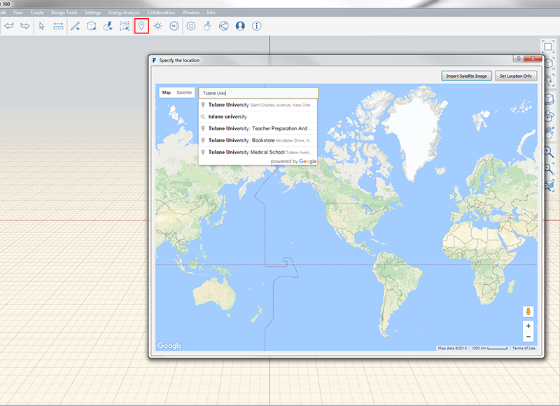
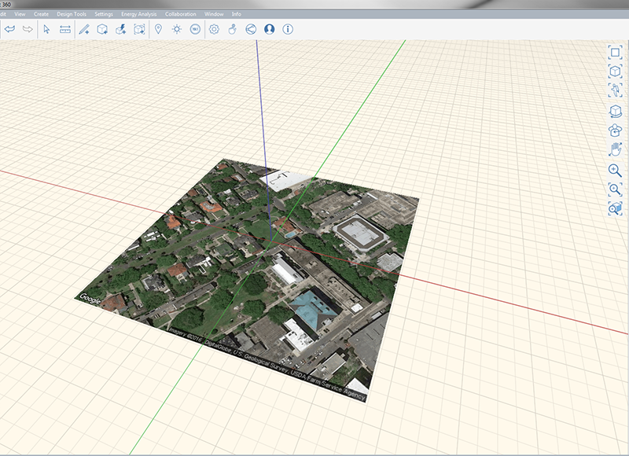

### Festlegen des Standorts

---

> Die Angabe des geografischen Standorts Ihres Projekts ist wichtig für die Genauigkeit von Analysen im weiteren Verlauf des Projekts. Es ist auch möglich, ein skaliertes Satellitenbild als Hintergrundreferenz zu importieren.

---

Um den Standort anzugeben, müssen Sie als Erstes sicherstellen, dass Sie bei Ihrem A360-Konto angemeldet sind. Sobald Sie angemeldet sind, können Sie auf die Standortfunktion (LS) zugreifen.

* Beginnen Sie, indem Sie den Standort des Projekts in das Suchfeld in der oberen linken Ecke des Fensters *Standort angeben* eingeben. 
* Wenn Sie den Standort Ihres Projektgrundstücks und die Grenzen des zu importierenden Bereichs angegeben haben, klicken Sie auf **Bildimport fertig stellen** 
* Das Bild wird dann skaliert und importiert, wobei der geografische Norden oben liegt. Sie können die Darstellung des importierten Bildes ändern, indem Sie darauf doppelklicken und die [**Eigenschaftenpalette**](../formit-introduction/tool-bars.md) verwenden. 

