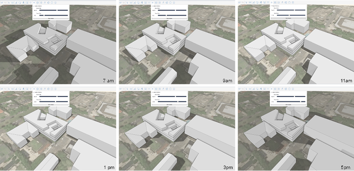

### Schatten

---

> Diese Funktion ermöglicht eine genaue Beurteilung der Auswirkungen der Sonnenbahn auf Ihr Projekt. Sie können dadurch die Wechselwirkung zwischen Ihrem Projekt und seinem Kontext vorhersagen.

---

Für präzise Schattenstudien müssen Sie als Erstes den [**Projektstandort festlegen**](setting-location.md). Nachdem Sie den Standort festgelegt und das skalierte Bild importiert haben, können Sie Ihr Projekt einschließlich Kontext und Bäumen modellieren. Um rasch eine Studie zu erstellen, können Sie über die [**Palette Inhaltsbibliothek**](../formit-introduction/tool-bars.md) bestehende Kontextmodelle übernehmen.

* Stellen Sie im nächsten Schritt sicher, dass die Schatten aktiviert sind. Diese Einstellung befindet sich in der [**Palette Bildstile**](../formit-introduction/tool-bars.md). 

* Klicken Sie auf die *Schaltfläche Sonne und Schatten* in der [**Aktionsleiste**](../formit-introduction/tool-bars.md). Dadurch wird ein Feld angezeigt, in dem Sie Datum und Uhrzeit festlegen können. 

* Anschließend können Sie Screenshots Ihrer Studien für Präsentationszwecke exportieren und durch Verwendung von Szenen auch animieren. 

