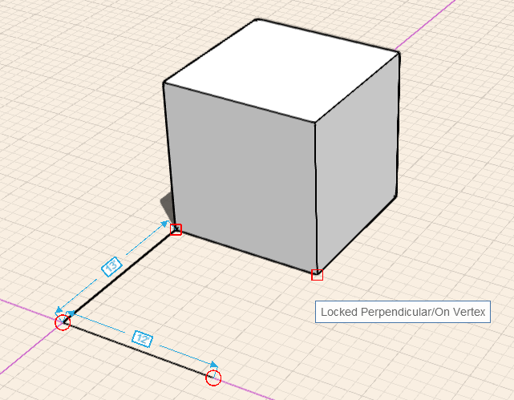

### Objektfang und Ableitungen

---

> Objektfang und Ableitungspunkte ermöglichen eine präzise Erstellung, Platzierung und Bearbeitung von Geometrie und erleichtern dadurch das Skizzieren und Modellieren. Sie können die Achse wählen, entlang derer Sie zeichnen oder eine andere Funktion ausführen möchten, etwa das Extrudieren einer Oberfläche.

---

**Anmerkung:** *Unter [Tastaturkurzbefehle](../Appendix/keyboard-shortcuts.md) finden Sie Informationen dazu, wie Sie noch schneller mit den Werkzeugen der Software arbeiten können.* 

#### Objektfang

Beim Skizzieren und Modellieren stehen mehrere Objektfangfunktionen zur Verfügung. Der Objektfang für Objekte ist automatisch aktiviert. Die folgenden Fangreferenzen sind verfügbar:

* Kante
* Mittelpunkt
* Endpunkte (Scheitelpunkt)
* Fläche
* Zentrum auf Fläche
* Grundplatte

Um den Objektfang am Raster zu aktivieren, müssen Sie die Option Rasterfang aus dem Menü Einstellungen aktivieren.

#### Ableitungspunkte

Die automatische Auswahl für Ableitungspunkte ist immer aktiviert und unterstützt Sie dabei, die Bewegungsmöglichkeiten für Geometrie einzuschränken.

**Achse:** Sie können Geometrie entlang der X-, Y- oder Z-Achse verschieben. Die Ableitung für die X-Achse ist rot, für die Y-Achse grün und für die Z-Achse blau.

**Achse sperren:** Sie können die Bewegung entlang der X-, Y- oder Z-Achse sperren. Halten Sie die Umschalttaste gedrückt, während Sie eine Achsenableitung verwenden, und bewegen Sie die Maus, um den Objektfang und die Ableitung mit anderen Elementen als Referenzen zu verwenden.

**Parallel:** Sie können Geometrie parallel zu bestehenden Elementen skizzieren oder verschieben. Lotrechte Ableitungen sind violett. Sie müssen den Cursor auf die Linie setzen, die Sie als parallele Referenz verwenden möchten.

**Lotrecht:** Es ist auch möglich, Geometrie lotrecht zu bestehenden Elementen zu zeichnen oder zu verschieben. Lotrechte Ableitungen sind violett. Sie müssen den Cursor auf die Linie setzen, die Sie als lotrechte Referenz verwenden möchten.

**Von einem Punkt ausgehend:** Sie können auch von einer Punktreferenz ausgehende Ableitungen verwenden. Setzen Sie den Cursor auf den Punkt, den Sie als Referenz verwenden möchten, bis die QuickInfo angezeigt wird, und verwenden Sie die von diesem Punkt ausgehende Ableitungsachse.

