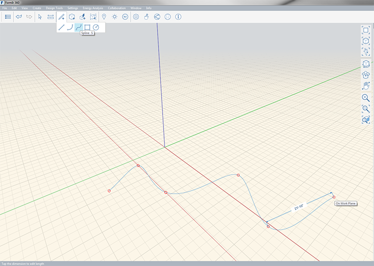
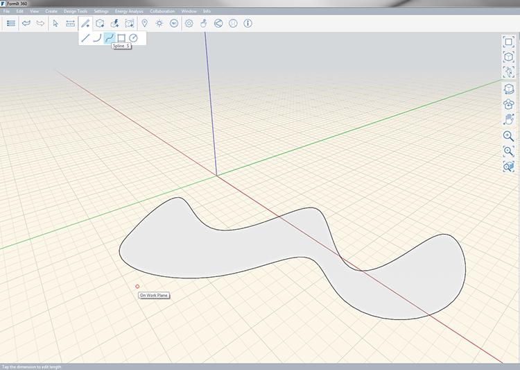

### Werkzeug Spline

---

> Mit dem Werkzeug Spline können Sie fließende Formen im Raum oder auf anderen Objekten skizzieren.

---

Ein Spline wird durch Interpolation zwischen mindestens drei Punkten gezeichnet. Die verbundene Geometrie wird vereinfacht, wobei eine glatte, fließende Kurve zwischen den angegebenen Punkten entsteht.

Die Länge der Linie wird beim Zeichnen angezeigt. Um manuell eine Länge einzugeben, drücken Sie die **Tabulatortaste**. Splines können auch geschlossen werden, wodurch eine Fläche entsteht.

