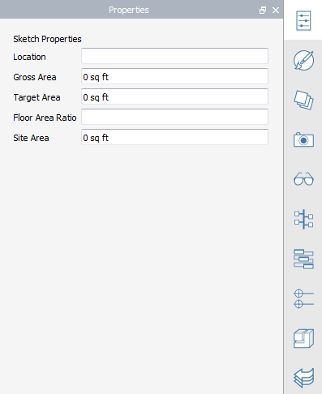
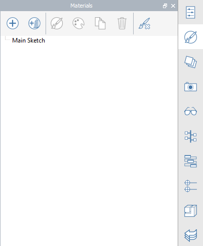
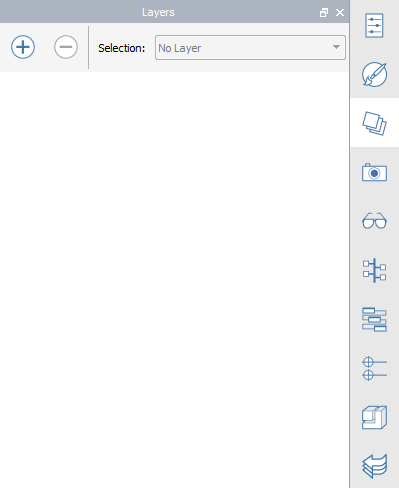
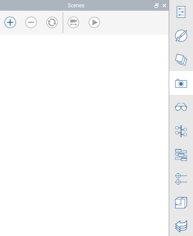
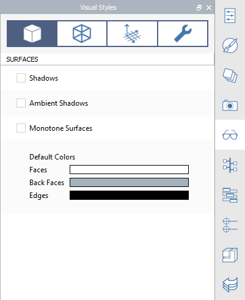
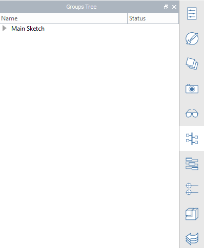
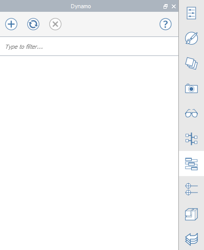
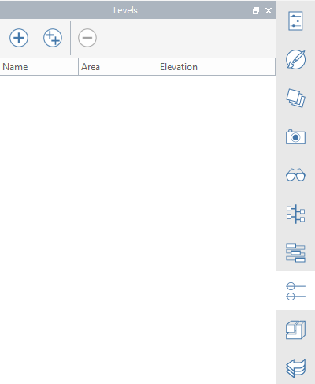
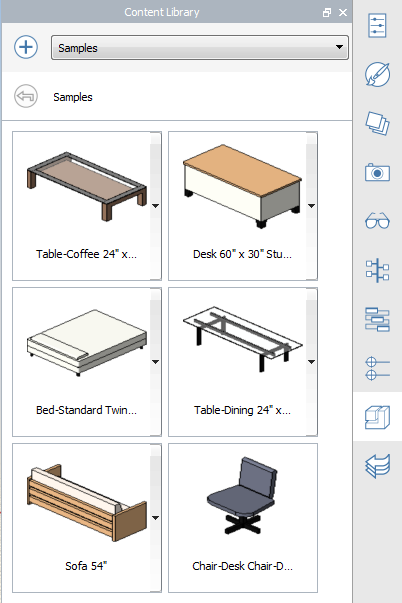
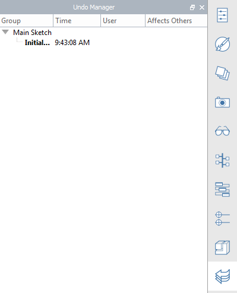

### Tool Bars Extended
---

#### Action Tool Bar
The Tool Bar is found at the top of the screen. The tools here will help you create, edit, and share content.

**1. Gallery Menu**

- New sketch, open sketch, save sketch, import or export files.

**2. Undo Redo**

- Click to undo or redo recent actions.

**3. Selection and Measurement**

- Selection Filter: Click to choose options for filtering out object types (edges, faces, solids, groups) from the selection tool.
- Measure Tools: Click to choose a linear or angular measure tool.

**4. Creation and Modification Tools**

- Sketch Tools: Click to bring up a menu of creation tools (line, arc, spline, rectangle, circle) that will help you draw shapes.
- Primitives: Click to bring up a menu of basic 3D shapes (cube, dome, pyramid, cylinder, roof) that you can place in your scene.
- Advanced Tools: Click to use boolean cut or join, cover, sweep, or loft operations.
- Groups: Click to locate tools for grouping objects.

**5. Location and Analysis Tools**

- Location: Search for location and import satellite imagery into your sketch.
- Sun and Shadows: Set time and day to view shadows and begin a solar analysis on a building.
- Energy Analysis: Click to perform calculations on a building to determine its energy use.

**6. User Identity**

- Settings: Set application and sketch settings along with visual style and perform model diagnostics.
- Touch Mode: 
- Collaboration: Start a session, join a session, or invite others to collaborate.
- Login to Autodesk360: Use the Autodesk 360 Cloud Services for free to store and share your sketches.
- Help: Use the information tools to learn more about FormIt 360.

#### Navigation Tool Bar
See [Navigating the Scene](../formit-introduction/navigating-the-scene.md).

#### Palette Bar 
The Palette Bar appears on the right side of the screen. Click one of these icons to open a side palette to display building properties, materials, a content library, and collaboration tools.

**1. Properties** Open this palette to view location, gross area, and floor area ratios for your sketch.

**2. Materials** Use this palette to create or apply materials.

**3. Layers** Use this palette to create and manage layers and assign selected objects to different layers.

**4. Scenes** Use this palette to create, manage, and play scenes.

**5. Visual Styles** Use this palette to edit the how the sketch is viewed by controlling shadows, surfaces, edges, and the environment.
 

**6. Group Tree** Use this palette to view groups and objects within each group. 

**7. Dynamo** Use this palette to load and manage computational models created in Dynamo Studio.

**8. Levels** Use this palette to display and add levels to your building objects. 

**9. Content Library** Use the content library to store reusable content such as furniture.

**10. Undo Manager** Use this palette to view each user's actions when collaborating.
