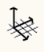

### Weltachsen

---

> Das vorgegebene Koordinatensystem und sein Raster können durch Ändern der Weltachse bearbeitet werden.

---

#### Wissenswertes über Zeichnungs- und Modellierungsachsen

Beim Öffnen einer leeren Skizze in FormIt 360 werden die Weltachsen in Form dreier Linien (rot, grün, blau) in der Mitte des Bildschirms angezeigt. Diese drei Linien markieren die drei kartesischen Richtungen, die die 3D-Welt definieren. Die X-Richtung wird durch die rote, die Y-Richtung durch die grüne und die Z-Richtung (nach oben) durch die blaue Linie definiert.

Um das Raster zu drehen, klicken Sie mit der rechten Maustaste auf eine leere Stelle in der Szene und wählen Sie  aus dem Kontextmenü. Ziehen Sie den roten Punkt, um den Ursprung zu verschieben, und einen der blauen Punkte, um die Achsen zu drehen.

Um die Vorgabeeinstellung für das Koordinatensystem und Raster wiederherzustellen, rechtsklicken Sie auf eine leere Stelle in der Szene und wählen Sie .

* Die **rote, grüne und blaue Achse** werden angezeigt und ermöglichen das Skizzieren in 3D, ohne dass das Werkzeug beendet werden muss.

* Die **violette Achse** stellt eine Achse relativ zu den Linien dar, die Sie gerade zeichnen.

* Halten Sie die **Umschalttaste** gedrückt und ziehen Sie ein Liniensegment für die **Beschränkung auf die aktuelle Achse**.

